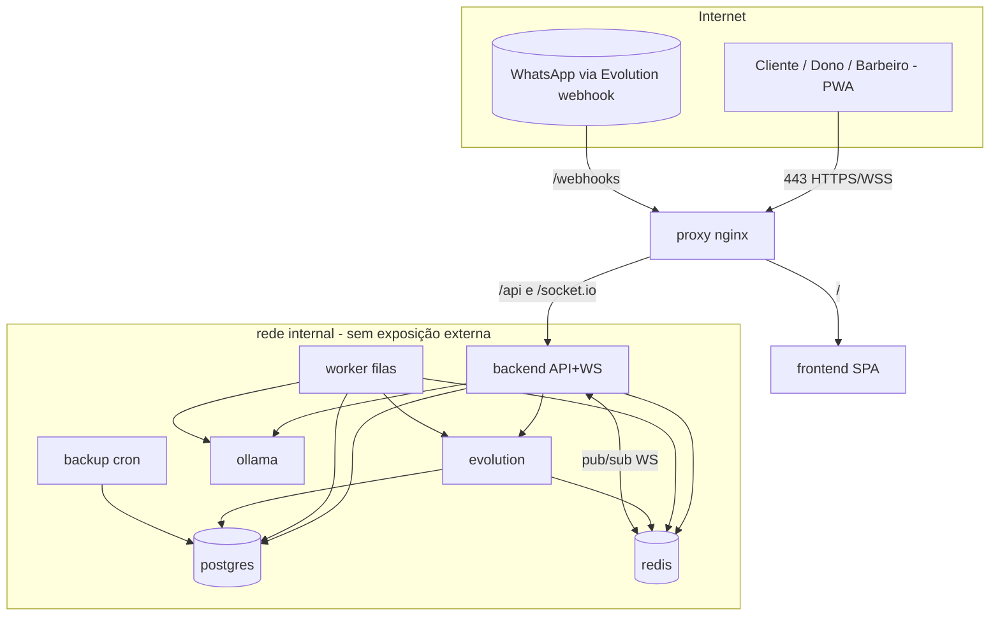

# Arquitetura Docker — Barber SaaS

Regra arquitetural: **o sistema nasce containerizado**. Nada de localhost/IP fixo — toda comunicação entre serviços usa **nome de container** (`postgres`, `redis`, `backend`, `frontend`, `evolution`, `ollama`, `worker`). A topologia é preparada para VPS Linux, escala horizontal, multi-tenant, WebSocket, backup, deploy automatizado e atualização sem downtime.

Arquivos: `docker-compose.yml` (prod), `docker-compose.override.yml` (dev), `.env.example`, `infra/nginx`, `infra/backup`, `infra/postgres/initdb`, `apps/*/Dockerfile`.

---

## 1. Organização dos containers

| Container | Imagem | Papel | Rede | Estado |
|---|---|---|---|---|
| `proxy` | nginx | TLS + reverse proxy (edge) | edge | stateless |
| `frontend` | build próprio (nginx+dist) | SPA React/Vite/PWA | edge | stateless |
| `backend` | build próprio (Node) | API REST + Socket.io | edge+internal | **stateless → escalável** |
| `worker` | mesma do backend | filas BullMQ (WhatsApp, IA, lembretes, tags) | internal | **stateless → escalável** |
| `migrate` | mesma do backend | aplica migrações 01→09 (one-shot) | internal | efêmero |
| `postgres` | postgres:17 | banco relacional (app + evolution db) | internal | **stateful (volume)** |
| `redis` | redis:7 | cache + filas + adapter Socket.io + rate-limit | internal | stateful (AOF) |
| `evolution` | evolution-api | WhatsApp (multi-instância) | internal | stateful (sessões) |
| `ollama` | ollama | IA local (LLM) | internal | stateful (modelos) |
| `backup` | postgres:17 + cron | pg_dump agendado + retenção | internal | escreve em volume |

Regra de ouro: o que é **stateless** (backend, worker, frontend, proxy) escala à vontade; o que é **stateful** (postgres, redis, evolution, ollama) tem volume nomeado e plano de backup.

### Diagrama lógico



Comunicação por nome: o backend fala com `postgres:5432`, `redis:6379`, `evolution:8080`, `ollama:11434`. O proxy resolve `backend:3000` e `frontend:80` pelo DNS interno do Docker (`resolver 127.0.0.11`), o que permite **re-resolver réplicas** quando o backend escala.

## 2. Redes

Duas redes isolam tráfego:

- **`edge`** (bridge): só `proxy`, `frontend`, `backend`. É a superfície pública (via proxy).
- **`internal`** (bridge, `internal: true` = **sem rota para a internet**): `postgres`, `redis`, `evolution`, `ollama`, `worker`, `backup`. Banco e IA nunca ficam expostos; só o backend os alcança.

Nenhuma porta de dado é publicada em produção (postgres/redis/evolution/ollama não têm `ports:`). Em dev, o `override` publica portas só para depuração — mas a comunicação entre serviços continua por nome.

## 3. Volumes persistentes

| Volume | Conteúdo | Backup |
|---|---|---|
| `pgdata` | dados do PostgreSQL | pg_dump diário + snapshot do volume |
| `redisdata` | AOF do Redis (filas/cache) | snapshot (não crítico; reconstruível) |
| `evolution_instances` | **sessões do WhatsApp** (crítico: reparear é chato) | snapshot frequente |
| `evolution_store` | mídia/store da Evolution | snapshot |
| `ollama_models` | modelos baixados (grandes) | snapshot ocasional / re-download |
| `uploads` | fotos de produto/cliente (driver local inicial) | snapshot + migrar p/ S3/Cloudinary |
| `backups` | dumps do Postgres | replicar para object storage off-site |
| `certs` | certificados TLS | snapshot |

Princípio: **dado vive em volume nomeado, nunca dentro do container**. Recriar/atualizar container não perde dado.

## 4. Organização dos backups

- Container `backup` roda `pg_dump -Fc` (formato custom) via cron (`BACKUP_CRON`, default 03:00), com retenção (`BACKUP_RETENTION_DAYS`, default 14 dias).
- Restauração: `pg_restore -h postgres -U postgres -d barber --clean --if-exists /backups/barber_XXXX.dump`.
- Camadas de proteção:
  1. **Dump lógico diário** (rápido de restaurar, seletivo).
  2. **Snapshot do volume** no nível do VPS (provedor) — recuperação de desastre.
  3. **Off-site** (opcional): enviar dumps para S3/Backblaze (`S3_*` no `.env`).
  4. **PITR (produção séria)**: evoluir para `pgBackRest`/WAL archiving quando o volume justificar — recuperação a um ponto no tempo.
- Regra de negócio do schema reforça: nada financeiro é apagado (soft delete + imutabilidade), então o backup protege contra desastre de infra, não contra erro de operação (que já é tratado por estorno/auditoria).

## 5. Fluxo de deploy

**Pipeline (CI/CD):**
1. Push na branch → CI roda testes (incl. smoke test do banco).
2. CI builda imagens `barber/backend` e `barber/frontend` e publica no registry (GHCR/Docker Hub) com tag de commit + `latest`.
3. No VPS: `docker compose pull && docker compose up -d`.
4. O serviço `migrate` roda **antes** do backend (`depends_on: service_completed_successfully`) aplicando 01→09. Migrações são **idempotentes** e **backward-compatible** (nunca quebram a versão anterior).

**Comandos:**
```bash
# subir tudo (prod)
docker compose --env-file .env up -d
# atualizar só o backend (sem derrubar o resto)
docker compose pull backend && docker compose up -d --no-deps backend
# escalar
docker compose up -d --scale backend=3 --scale worker=2
```

## 6. Atualização sem derrubar o sistema (zero-downtime)

- **Backend stateless atrás do proxy** com healthcheck: sobe a nova réplica, o nginx só envia tráfego quando `/health` responde, e a antiga é drenada. Com `--scale backend=2+`, a atualização é rolling.
- **Migrações compatíveis**: regra "expand/contract" — primeiro adiciona coluna/tabela (expand), implanta código que usa ambos, depois remove o antigo (contract) numa release seguinte. Assim a versão N e N+1 convivem durante o deploy.
- **WebSocket resiliente**: Socket.io com **adapter Redis** → uma queda de réplica reconecta o cliente em outra sem perder o namespace `shop:{id}`.
- **Worker idempotente**: filas BullMQ com retry; reprocessar não duplica (idempotency_key em pagamento/pedido/mensagem).
- Produção em escala maior: migrar para **Docker Swarm** (`docker stack deploy`) ou Kubernetes para rolling update declarativo e self-healing — a topologia já está pronta para isso (serviços stateless + estado em volumes/serviços gerenciados).

## 7. Estratégia de escalabilidade

| Camada | Como escala |
|---|---|
| Frontend | estático/CDN; réplicas triviais |
| Backend (API+WS) | **horizontal** (N réplicas) — stateless, sessão no JWT, WS via Redis adapter |
| Worker | **horizontal** por fila; filas separadas (whatsapp-send, campaign-dispatch, ai-jobs, reminders) escalam independente |
| Postgres | vertical primeiro; depois **read replicas** + **pgBouncer** (pool); multi-tenant por RLS permite **shard por `account_id`** no futuro |
| Redis | cluster/sentinela quando necessário |
| Evolution | **multi-instância** (um número por barbearia); pode ir para VPS dedicada |
| Ollama | mover para VPS com **GPU**; pode servir várias barbearias |

Multi-tenant: o isolamento por `barbershop_id` + RLS já está no banco. Crescer para franquias/multi-unidade é adicionar barbearias na mesma instância; crescer para muitos tenants é sharding por conta — sem refazer o schema.

## 8. Preparação para múltiplos servidores (split multi-VPS)

A chave: **todo host é uma variável de ambiente** apontando para um nome, nunca um IP. Hoje `OLLAMA_URL=http://ollama:11434`; amanhã `OLLAMA_URL=http://ollama.vps2.mesh:11434`.

Split-alvo:

```
VPS 1 (app)         VPS 2 (IA/mensageria)      VPS 3 (futuro: processamento)
- proxy             - ollama                   - worker (réplicas extras)
- frontend          - evolution                - filas de campanha em massa
- backend           - (IA futura)              - jobs pesados de IA
- postgres
- redis
```

Como fazer sem reescrever:
1. **Rede mesh privada** entre as VPS (WireGuard ou Tailscale) → cada serviço vira um nome resolvível (`ollama.vps2.mesh`), mantendo a regra "nome, não IP".
2. Trocar no `.env` da VPS1: `OLLAMA_URL`, `EVOLUTION_API_URL` para os nomes da VPS2.
3. Em escala, promover para **Docker Swarm overlay network** ou Kubernetes: os nomes de serviço continuam resolvendo entre nós, e o código não muda.
4. Postgres/Redis podem virar **serviços gerenciados** (RDS/ElastiCache equivalentes) — basta apontar `DATABASE_URL`/`REDIS_URL`.

Como o backend e o worker já se comunicam só por `EVOLUTION_API_URL`/`OLLAMA_URL`/`DATABASE_URL`/`REDIS_URL`, mover qualquer peça para outra VPS é **mudança de configuração, não de código**. É exatamente isso que "nascer preparado para Docker" garante.

---

## Resumo das garantias pedidas

- ✅ Containerizado desde o início, serviços independentes por função.
- ✅ Comunicação por nome de container; zero localhost/IP fixo.
- ✅ Pronto para VPS Linux, escala horizontal e multi-tenant.
- ✅ WebSocket escalável (Redis adapter).
- ✅ Backup do Postgres automatizado + restauração documentada.
- ✅ Deploy automatizado e atualização rolling sem downtime.
- ✅ Volumes persistentes organizados e isolados.
- ✅ Caminho claro para split em múltiplas VPS sem refatorar código.
